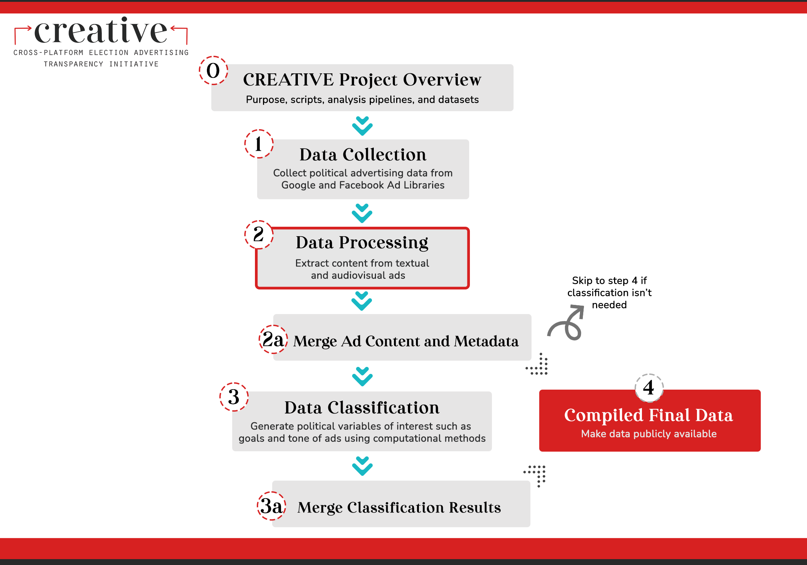

# CREATIVE --- datasets

Welcome! This repo contains datasets for political ad classification on social media.

This repo is a part of the [Cross-platform Election Advertising Transparency Initiative (CREATIVE)](https://www.creativewmp.com/). CREATIVE is an academic research project that has the goal of providing the public with analysis tools for more transparency of political ads across online platforms. In particular, CREATIVE provides cross-platform integration and standardization of political ads collected from Google and Facebook. CREATIVE is a joint project of the [Wesleyan Media Project (WMP)](https://mediaproject.wesleyan.edu/) and the [privacy-tech-lab](https://privacytechlab.org/) at [Wesleyan University](https://www.wesleyan.edu).

To analyze the different dimensions of political ad transparency we have developed an analysis pipeline. This repo is a part of the Data Processing step of our pipeline.

## Table of Contents

[1. Introduction](#1-introduction)  
[2. Data](#2-data)  
[3. Thank you!](#3-thank-you)

## 1. Introduction

This repo store datasets which are used as inputs to classifiers and other scripts of the CREATIVE project. Some repos utilize TV data, which are not included in this repo due to contractual restrictions. To access the TV datasets please apply directly. Visit <http://mediaproject.wesleyan.edu/dataaccess/> and fill out the online request form for accessing TV datasets. The creation of the datasets in this repo is not assumed to be replicable.

The datasets in this repo are utilized in the following CREATIVE repos:

- [forum_digital_2022](https://github.com/Wesleyan-Media-Project/forum_digital_2022)
- [ad_goal_classifier](https://github.com/Wesleyan-Media-Project/ad_goal_classifier)
- [party_classifier](https://github.com/Wesleyan-Media-Project/party_classifier)
- [ad_tone](https://github.com/Wesleyan-Media-Project/ad_tone)
- [data-post-production](https://github.com/Wesleyan-Media-Project/data-post-production)
- [entity_linking_2022](https://github.com/Wesleyan-Media-Project/entity_linking_2022)
- [face_url_scraper_2022](https://github.com/Wesleyan-Media-Project/face_url_scraper_2022)
- [negativity](https://github.com/Wesleyan-Media-Project/negativity)
- [ABSA](https://github.com/Wesleyan-Media-Project/ABSA)
- [fb_2022](https://github.com/Wesleyan-Media-Project/fb_2022)
- [party_classifier_pdid](https://github.com/Wesleyan-Media-Project/party_classifier_pdid)
- [mask](https://github.com/Wesleyan-Media-Project/mask)
- [race_of_focus](https://github.com/Wesleyan-Media-Project/race_of_focus)
- [entity_linking](https://github.com/Wesleyan-Media-Project/entity_linking)
- [fb_2020](https://github.com/Wesleyan-Media-Project/fb_2020)

## 2. Data

The data in this repo is mostly in csv format.

### 2.1 `candidates`

The data in the `candidates` folder is mostly about political candidates' information:

- The data started with `wmpcand` is the candidate characteristics collected by WMP and in partnership with [OpenSecrets](https://www.opensecrets.org/), where each candidate has its own unique identifier created and used by WMP (because candidates often have multiple Federal Election Commission (FEC) identifiers since they can run for different offices within and across cycles, WMP uses our own to help distinguish individuals). The data `opponents_2022.R` contains information on political candidates and their opponents for elections held in 2022, which is needed to compute ad tone based on whether an ad mentions an opponent. Both `face_url_politician.csv` and `face_url_candidate.csv` contain candidates' face_url that can be used for face recognition.
- As noted previously, some candidates have multiple Federal Election Commission (FEC) identifiers (fecids). `corrections_fecids.csv` exists to deal with this issue. For any fecid (first column), the second column specifies what it should be changed to. If a candidate had 3 fecids, and, say, the first one is the correct one, then they would simply have two rows, one with 2 -> 1, and one with 3 -> 1. The third column is purely cosmetic, just so that it is easier to remember who is who.

### 2.2 `facebook`

The data in the `facebook` folder contains a range of datasets that are used in the Facebook ads collection. `asr_fb2022_0905_1108.csv` is the dataset for auto-speech recognition. It contains ads' unique id, location in the WesMedia server, SHA256 checksum for the video file, asr status, models, media types, etc.

### 2.3 `people`

The data in the `people` folder contains information about the candidates collected by WMP who appear in the ads. The datasets contain fields including the candidates' unique id: `wmpid`, their full name `full_name`, FEC identifiers for different years or campaign cycles `fecid_2020`, `fecid_2022a`,`fecid_2022b`, `fecid_2022old`, Date candidate was added to the WMP person-level file `dateadded_person`, etc.

### 2.4 `wmp_entity_files`

The data in the `wmp_entity_files` folder contains entity files, which are essentially information about each advertiser, created by WMP and in partnership with [OpenSecrets](https://www.opensecrets.org/). These files essentially match advertiser information to other sources of data like FEC identifiers and add important contextual information like whether the advertiser is a candidate, a party, an outside group, or unknown, etc. The datasets in this folder are divided into Google entity files and Facebook entity files.

### 2.5 `google`

The data in the 'google' folder is composed of files containing Google 2020 data. These files include `google_2020_adid_06102022.csv.gz`, `google_2020_adid_text_clean.csv.gz` and `google_2020_adid_var1.csv.gz`. Generally these files are being preserved for internal use, as they are used in legacy scripts. 

## 3. Thank You

<strong>We would like to thank our supporters!</strong>
 

This material is based upon work supported by the National Science Foundation under Grant Numbers 2235006, 2235007, and 2235008.

  

The Cross-Platform Election Advertising Transparency Initiative (CREATIVE) is a joint infrastructure project of the Wesleyan Media Project and privacy-tech-lab at Wesleyan University in Connecticut.

  

  

  

