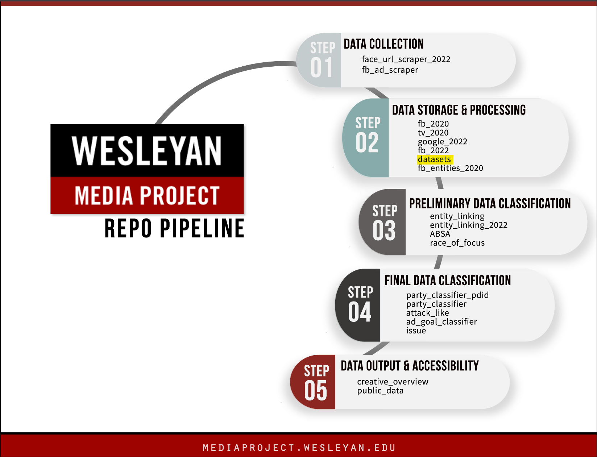

# Wesleyan Media Project - datasets

Welcome! This repo is part of the Cross-platform Election Advertising Transparency initiatIVE (CREATIVE) project. CREATIVE is a joint infrastructure project of WMP and privacy-tech-lab at Wesleyan University. CREATIVE provides cross-platform integration and standardization of political ads collected from Google and Facebook.

This repo is a part of the data storage and processing step. The output of this repo can be utilized in

- [forum_digital_2022](https://github.com/Wesleyan-Media-Project/forum_digital_2022)
- [ad_goal_classifier](https://github.com/Wesleyan-Media-Project/ad_goal_classifier)
- [party_classifier](https://github.com/Wesleyan-Media-Project/party_classifier)
- [ad_tone](https://github.com/Wesleyan-Media-Project/ad_tone)
- [data-post-production](https://github.com/Wesleyan-Media-Project/data-post-production)
- [entity_linking_2022](https://github.com/Wesleyan-Media-Project/entity_linking_2022)
- [face_url_scraper_2022](https://github.com/Wesleyan-Media-Project/face_url_scraper_2022)
- [negativity](https://github.com/Wesleyan-Media-Project/negativity)
- [ABSA](https://github.com/Wesleyan-Media-Project/ABSA)
- [fb_2022](https://github.com/Wesleyan-Media-Project/fb_2022)
- [party_classifier_pdid](https://github.com/Wesleyan-Media-Project/party_classifier_pdid)
- [mask](https://github.com/Wesleyan-Media-Project/mask)
- [race_of_focus](https://github.com/Wesleyan-Media-Project/race_of_focus)
- [entity_linking](https://github.com/Wesleyan-Media-Project/entity_linking)
- [fb_2020](https://github.com/Wesleyan-Media-Project/fb_2020)
- [attack_like](https://github.com/Wesleyan-Media-Project/attack_like)

## Table of Contents

- [Introduction](#introduction)

- [Objective](#objective)

- [Data](#data)

## Introduction

This repository is meant as a place to store datasets whose creation isn't assumed to be replicable (but which are used as inputs to other things that are meant to be replicable from that point on). When you need to replicate the workflow of other repositories mentioned above, you can use the data in this repository as input. Some repositories utilize TV data, which is not included in this repository due to contractual restrictions. To access the raw TV datasets, users are required to apply directly. Visit http://mediaproject.wesleyan.edu/dataaccess/ and fill out the online request form to access the TV datasets.
## Objective

Each of our repos belongs to one or more of the following categories:

- Data Collection
- Data Storage & Processing
- Preliminary Data Classification
- Final Data Classification

This repo is part of the Data Storage & Processing section.

## Data

The data created by the scripts in this repo is mostly in CSV format.

The data in the folder `candidates` is mostly about the candidates' information.

- The data started with `wmpcand` is the candidate characteristics collected by WMP, where each candidate has its own unique identifier used by the WMP. The data `opponents_2022.R` contains information on political candidates and their opponents for an election held in 2022. Both `face_url_politician.csv` and `face_url_candidate.csv` contain candicates' face_url that can be used for face recognition.

- Some candidates have multiple fecids. `corrections_fecids.csv` exists to deal with this issue. For any fecid (first column), the second column specifies what it should be changed to. If a candidate had 3 fecids, and let's say the first one is the correct one, then they would simply have two rows, one with 2 -> 1, and one with 3 -> 1. The third column is purely cosmetic, just so it's easier to remember who is who.

The data in the folder `facebook` contains a range of datasets that are used in the Facebook ads collection. `asr_fb2022_0905_1108.csv` is the dataset for auto-speech recognition. It contains ads' unique id, location in the wesmedia server, SHA256 checksum for the video file, asr status, models, media types, etc.

The data in folder `people` contains information about the candidates collected by WMP who are involved in the ads. The datasets contain fields including the candidates' unique id: `wmpid`, their full name `full_name`, FEC identifiers for different years or campaign cycles `fecid_2020`, `fecid_2022a`,`fecid_2022b`, `fecid_2022old`, Date candidate was added to the WMP person-level file `dateadded_person`, etc.

The data in folder `wmp_entity_files` contains the entity files created by WMP. The datasets in this folder are divided into Google entity files and Facebook entity files.
